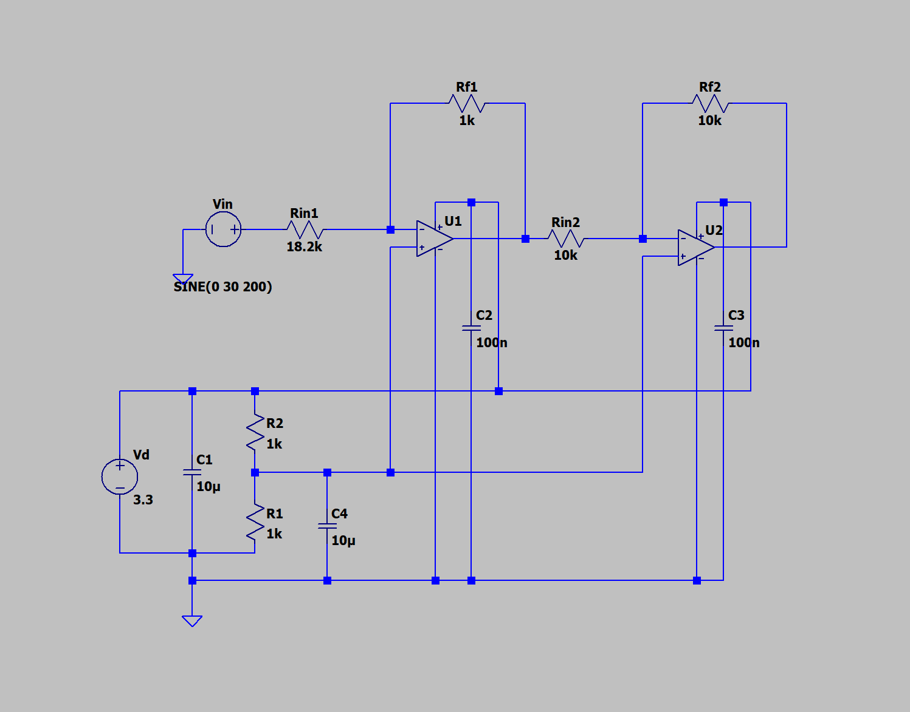
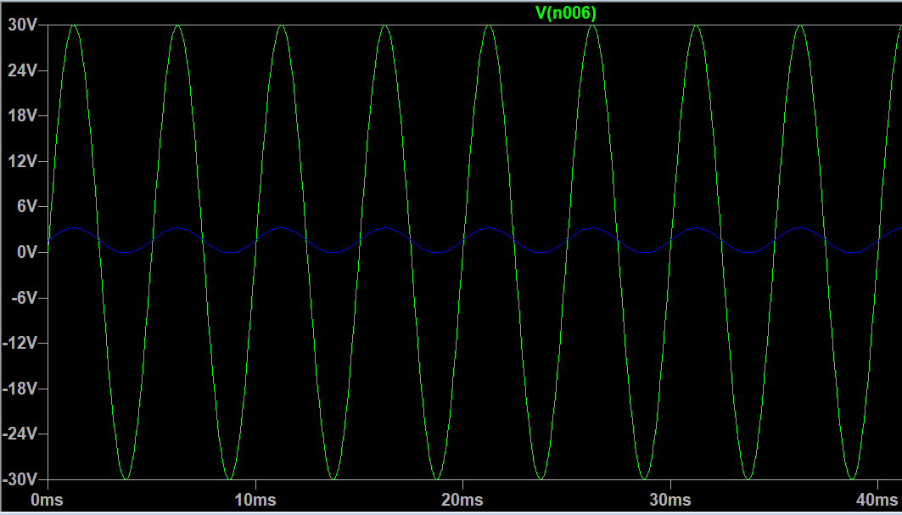
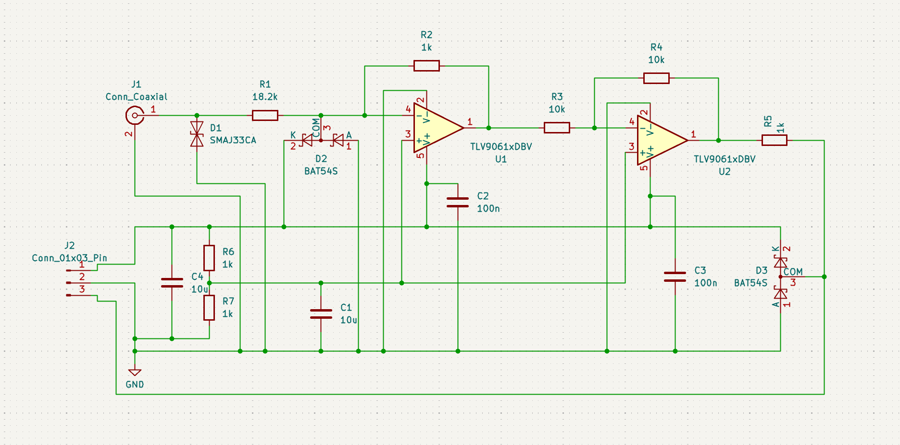
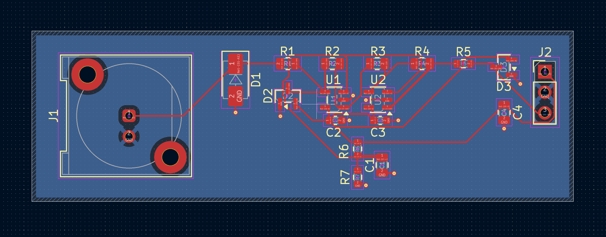
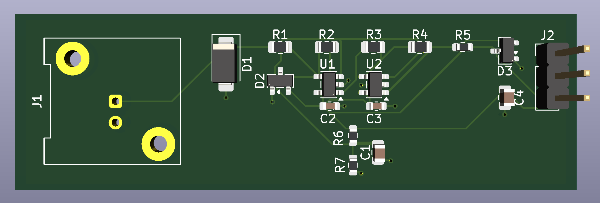

# DIY Oscilloscope
 
An ESP32-based DIY oscilloscope.

## Analogue front end
 
The ESP32's ADC only accepts 0-3.3 V, but I want to probe signals up to ±30 V. The front end sits between the probe and the ADC.

- **Scaling:** a two-stage inverting op-amp circuit brings the ±30 V input down to the ADC's [0-3.3 V] range.
- **Protection:** a TVS diode at the probe, a series resistor, and a Schottky clamp at the ADC pin.
### LTspice
 

 
### KiCad
 

 
## References
- [Qasim Asghar](https://www.youtube.com/watch?v=ud-KkpsHcRo)
